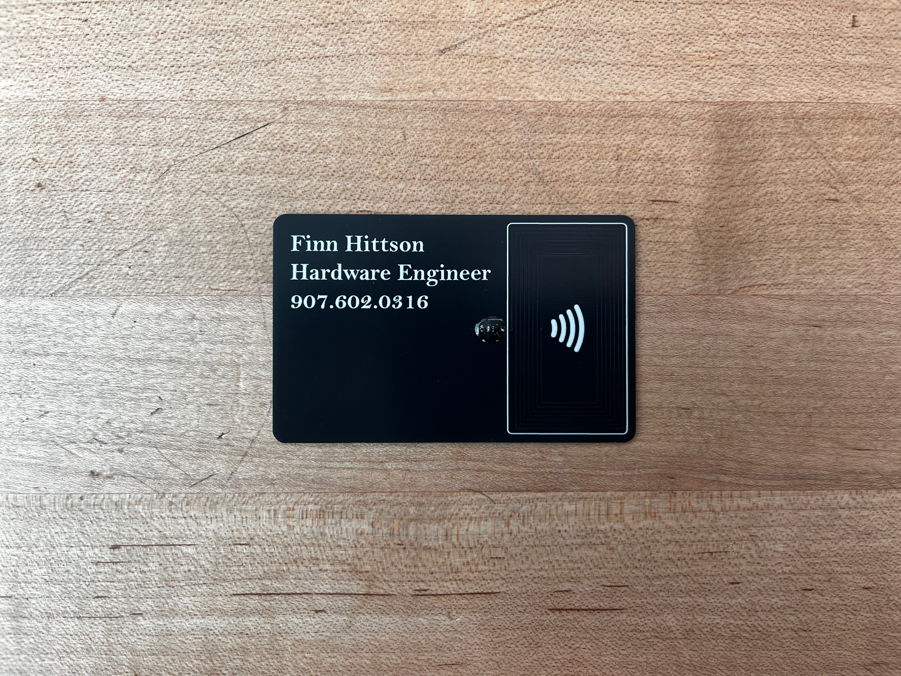
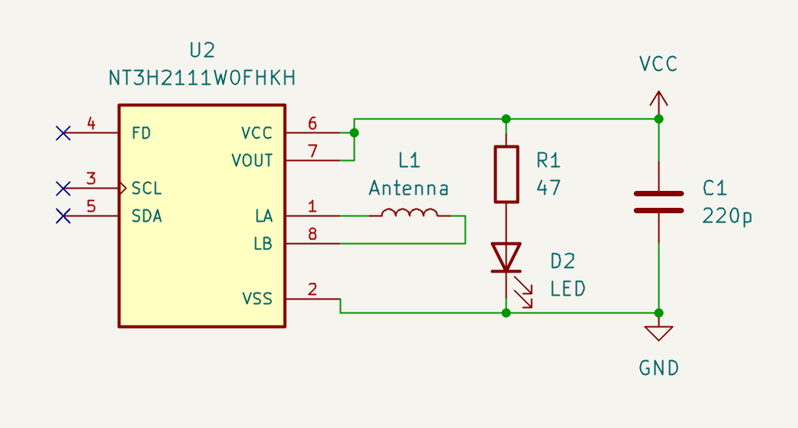
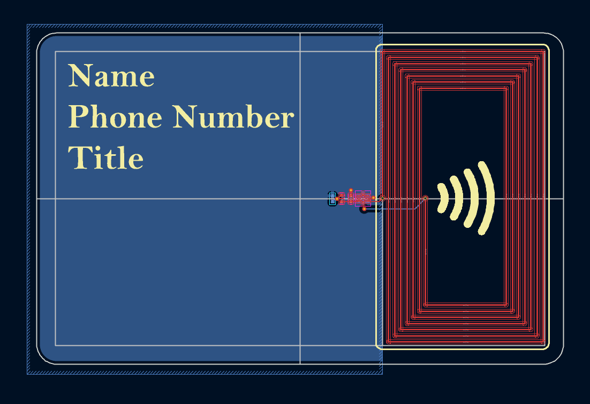
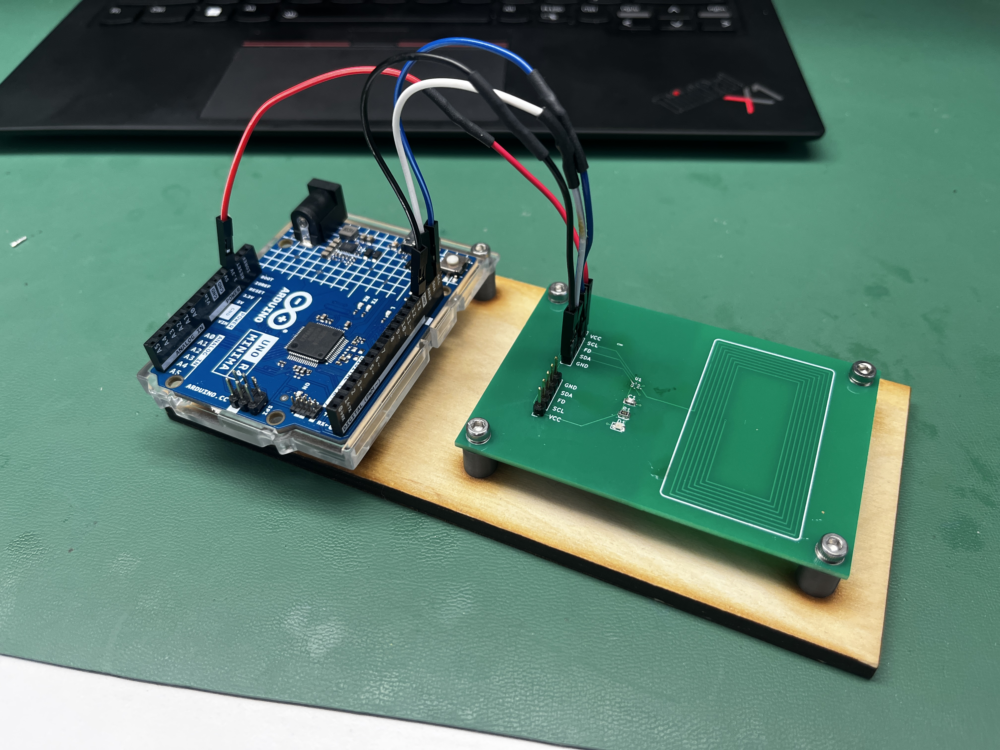
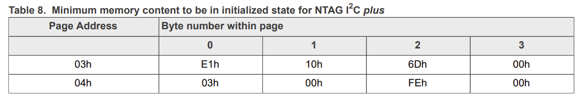

# PCB Business Card

This repo contains all information needed to make a PCB business card. The card features NFC IC that allows users to tap their phone and receive the stored data on the card. Ideally this card is used at recruiting events to share a resume or a portfolio while also demonstrating one’s ability to make such a card. It also doubles as a fun way to rick roll your friends. This repo has a template for users to make their own PCB business card using the KiCad files in the `electrical/` directory and the necessary software to configure the NFC tag in the `software/` directory. The image below is my personal business card, but this repo also contains steps I took to make these cards in bulk. To see a demonstration of these cards working see this [link](https://youtu.be/k8sX_htg_Z4) and to see different designs see this [link](https://youtu.be/7vKhVwrzvhk).

## Electrical

The schematic for the business card is very simple consisting of 5 devices. There is a resistor and LED to add effect and ambiance to the PCB and show the result of effective energy harvesting. There is a capacitor to store energy from the coil antenna. And finally, there is the NFC IC which is responsible for harvesting the energy captured by the coil, storing the data in EEPROM, and communicating with the phone. The following is the schematic for the card drawn in KiCad.

The IC used for this is the [NT3H2111W0FHKH](https://www.digikey.com/en/products/detail/nxp-usa-inc/NT3H2111W0FHKH/5872977?s=N4IgTCBcDaIKwDYAcBaAjGAnABmysKAcgCIgC6AvkA). The most engineeringly complex part of this card is the design of the antenna. The antenna effectively is an inductor that captures the magnetic field radiated from the phone. The phone generates an oscillating magnetic field at 13.56MHz and the capacitor on the IC forms a resonant take with the inductor to maximize energy captured. Thus, to design the antenna you can use the LC resonance formula below to calculate the value of inductance required. The datasheets recommends using a 220pF capacitor and with the frequency set to 13.56MHz we can rearrange and calculate the value for L.

$f_0=\frac{1}{2\pi\sqrt{LC}}$

Going through the math it is roughly 626nH. Next is to design the physical shape of the antenna and make sure it has 626nH of inductance. There are many inductor calculators online, but I found [this](https://eds.st.com/antenna/#/) one to be most helpful. This calculator lets you give dimensions for your antenna which is very helpful since we want this on a PCB with credit card dimensions. The next thing is to make a footprint with the same dimensions that the antenna calculator created. The image below is an image of the antenna laid out on a PCB template.

With the PCB you can then modify the front and back silkscreen to have your name, phone number, and title. The backside can then have an image in which you can integrate an LED to add a cool effect.

## Software

Annoyingly the [NT3H2111W0FHKH](https://www.digikey.com/en/products/detail/nxp-usa-inc/NT3H2111W0FHKH/5872977?s=N4IgTCBcDaIKwDYAcBaAjGAnABmysKAcgCIgC6AvkA) IC come off the fab line in a read only state. I learned this the hard way when I soldered all my devices to my PCB card and couldn't write to it. To fix this I made another PCB to act as my programmer board that would unlock the ICs and then I would solder these unlocked ICs to the business cards. I wanted to use the smallest IC's possible, so the package type is an 8 pin QFN style package which is mighty small. I hot air gunned the IC to the PCB then programmed it using an Arduino as shown in the image below.

What the Arduino code is setting is the capability container (CC), described on page 25 of the datasheet, to have read and write access. This is done by setting the registers outlined in Table 8. This gives the CC register read write access.

However, because of the way memory is organized in this IC, caution needs to be taken so that you do not change other settings. When reading and writing to these registers you can only read and write to an entire page which contains more information than you need. A page at 16 bytes and we only need to modify 4 at a time. Therefore, the software reads a page, modifies the 4 bytes while leaving the other 12 unchanged, and then writes the entire page back to memory. Another caveat is that in enabling read write access for CC, the I2C address changes from 0x55 to 0x02 and you need to repeat the process twice; once for the 0x55 address and once for the 0x02 address. I found it easiest to start with the 0x55 address, verify the device was visible on the I2C bus, write my data, and repeat the process. I knew the write was successful if when I checked the I2C bus again I would see a device at 0x02 and no other address.

Once all of this was done and the unlocked IC is soldered to the board, I used NFC Tools app to program the IC to either my resume, linked account, or this [link](https://www.youtube.com/watch?v=dQw4w9WgXcQ).
